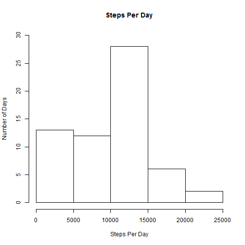
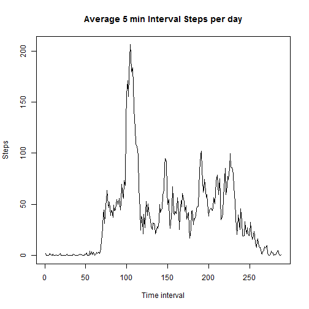
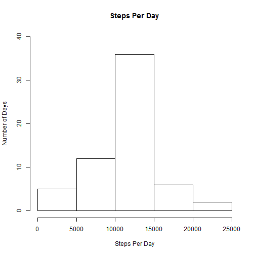
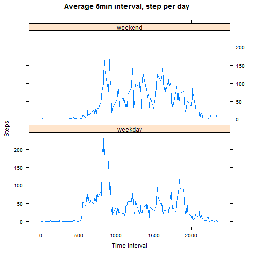

This file is the result of the Assigment 1 in online course Reproducible Research.

Loading and preprocessing the data:

```r
data <- read.csv("activity.csv")
```
Calculate the total number of steps taken per day

```r
StepsPerDay<-tapply(data$steps,data$date,sum,na.rm=TRUE)
```
Make a histogram of the total number of steps taken each day

```r
hist(StepsPerDay,xlab="Steps Per Day",ylab = "Number of Days",ylim=c(0,30),main="Steps Per Day")
```

 

Calculate and report the mean and median of the total number of steps taken per day

```r
meanSteps<-mean(StepsPerDay,na.rm=TRUE)
medianSteps<-median(StepsPerDay,na.rm=TRUE)
```
Mean Steps per day is 9354.2295082 Median Steps per day is 10395.


Make a time series plot (i.e. type = "l") of the 5-minute interval (x-axis) and the average number of steps taken, averaged across all days (y-axis)

```r
timeSeries<-tapply(data$steps,data$interval,mean,na.rm=TRUE)
plot(timeSeries,type="l",main="Average 5 min Interval Steps per day",xlab="Time interval",ylab="Steps")
```

 

Which 5-minute interval, on average across all the days in the dataset, contains the maximum number of steps?

```r
maxInterval<-names(which.max(timeSeries))
```
The 5 minute interval with the max val is 835.

Calculate and report the total number of missing values in the dataset (i.e. the total number of rows with NAs)

```r
NumNa<-sum(is.na(data$steps))
```
Number of NA values 2304.

Devise a strategy for filling in all of the missing values in the dataset. The strategy does not need to be sophisticated. For example, you could use the mean/median for that day, or the mean for that 5-minute interval, etc.
Create a new dataset that is equal to the original dataset but with the missing data filled in.

```r
FixedData<-data
for (i in 1:nrow(FixedData)){
  if(is.na(FixedData[i,1])){
    FixedData[i,1]<-timeSeries[[as.character(FixedData[i,"interval"])]]
  }
}
```

Make a histogram of the total number of steps taken each day and Calculate and report the mean and median total number of steps taken per day. Do these values differ from the estimates from the first part of the assignment? What is the impact of imputing missing data on the estimates of the total daily number of steps?

```r
StepsPerDay<-tapply(FixedData$steps,FixedData$date,sum,na.rm=TRUE)
hist(StepsPerDay,xlab="Steps Per Day",ylab = "Number of Days",ylim=c(0,40),main="Steps Per Day")
```

 

```r
NewMeanSteps<-mean(StepsPerDay,na.rm=TRUE)
NewMedianSteps<-median(StepsPerDay,na.rm=TRUE)
```
Mean Steps per day is 1.0766189 &times; 10<sup>4</sup> Median Steps per day is 1.0766189 &times; 10<sup>4</sup>
The impact of fixing the data is that the average steps per day increased from 9354.2295082 to 1.0766189 &times; 10<sup>4</sup>.

Create a new factor variable in the dataset with two levels - "weekday" and "weekend" indicating whether a given date is a weekday or weekend day.

```r
weekenddays <- c("Saturday","Sunday")
FixedData$daytype <- as.factor(sapply(as.Date(data$date,format = "%Y-%m-%d"), function(x) ifelse(weekdays(x) %in% weekenddays,"weekend","weekday")))
```

Make a panel plot containing a time series plot (i.e. type = "l") of the 5-minute interval (x-axis) and the average number of steps taken, averaged across all weekday days or weekend days (y-axis). See the README file in the GitHub repository to see an example of what this plot should look like using simulated data.

```r
actperweekd <- aggregate(FixedData$steps, by = list(FixedData$daytype,FixedData$interval), FUN = mean)
names(actperweekd) <- c("daytype","interval","mean_steps")
library("lattice")
xyplot(actperweekd$mean_steps ~ actperweekd$interval | actperweekd$daytype, type ="l", layout=c(1,2), xlab="Time interval", ylab="Steps", main ="Average 5min interval, step per day")
```

 
